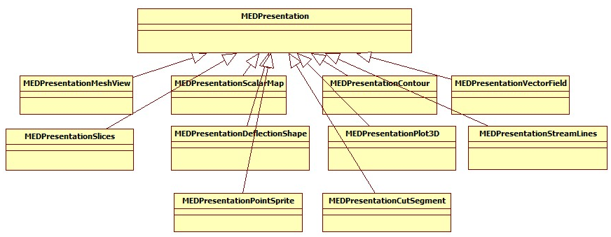

.. _fields_arch_implementation_layer_page:

**********************************
FIELDS module implementation layer
**********************************

FIELDS module uses Python API of the ParaVis module to build presentations. Internally any presentation of the FIELDS module is implemented as a particular pipeline of the ParaVis filters, which always starts with the *MEDReader*.
At the implementation level, a pipeline which represents presentation is built via a sequence of the Python commands. These command are executed in the builtin Python interpreter.

The hierarchical structure of the presentation classes is shown on the diagram:

The base class for all presentations is ``MEDPresentation``; it contains base functionalities for all presentations. All others classes implement functionalities of particular presentations.

