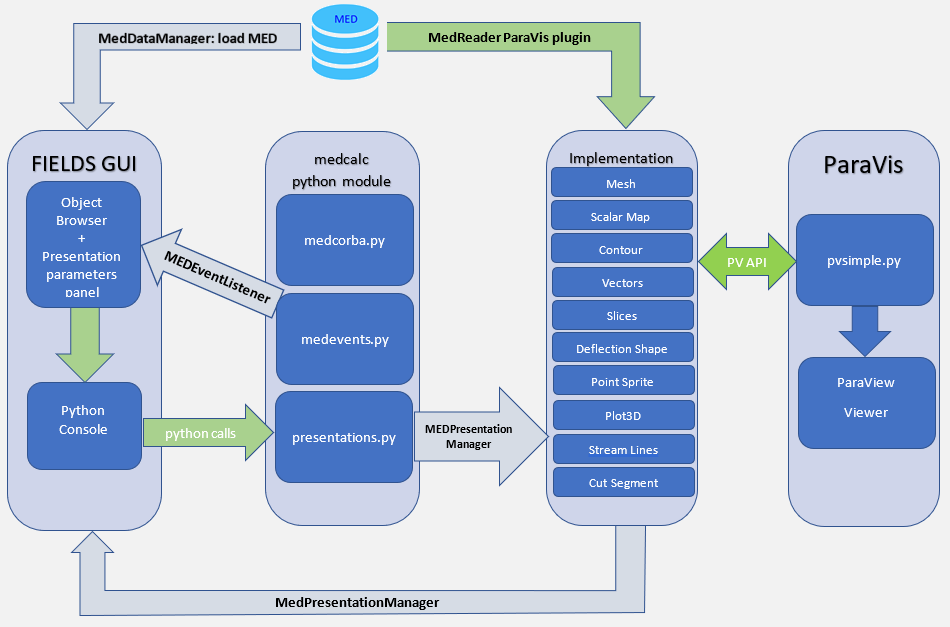

.. _fields_arch_introduction_page:

******************************************
Introduction to FIELDS module architecture
******************************************

Generally FIELDS module architecture is presented on the scheme above.
FIELDS module is used for analysis and post-processing of numerical simulation results. It is based upon ParaVis module, MEDReader ParaVis module plugin and MEDCoupling library.
FIELDS module uses Python API of the ParaVis module to build presentations. Any presentation in the FIELDS module is a pipeline of the ParaVis filters, which always starts with MEDReader. 
ParaVis module API is used via medcalc Python module and CORBA services.

In the FIELDS module architecture, the following parts can be distinguished:

.. toctree::

   fields_arch_gui.rst 
   fields_arch_medcalc_py.rst
   fields_arch_corba_services.rst
   fields_arch_implementation_layer.rst

See also:

.. toctree::

   fields_arch_plot3d_implementation_example.rst
