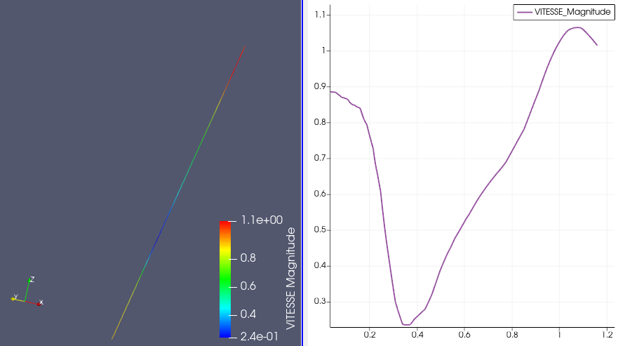
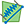

.. _fields_cut_segment_presentation_page:

************************
Cut Segment presentation
************************

**Cut segment** presentation is a type of presentation which displays colored cells with applied scalar values on the
mesh where cut segment is placed.

To create a **Cut segment** presentation,

* Select a field item in the **Object Browser**, and
* Choose **Presentations > Cut segment** menu or click |img_cs| button in the *Presentations* toolbar.

As a result, **Cut segment** presentation is published in the **Object Browser** under selected field and displayed
in the 3D Viewer. In addition, 2D presentation is displayed in the 2D Viewer; this 2D presentation consist of the
field scalar values located on the cut segment of the constructed presentation.

**Cut segment** presentation has the same base parameters as a :ref:`fields_scalar_map_presentation_page`, but
in addition it also has the following own specific parameters:

* **Point 1**: cut segment's start coordinates,
* **Point 2**: cut segment's end coordinates.
