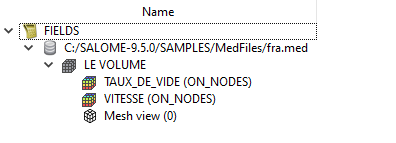

.. _fields_data_source_page:

***********
Data Source
***********

Data Source for all presentations of Fields module is a MED file. To add Data Source into Fields module, choose
**File > Add Data Source** menu (or click **Add Data Source** |img| button in the *Datasource* toolbar).
This shows a standard dialog that allows browsing and choosing \*.med files:

Select a file and confirm your choice by pressing **Open** button.
As a result, Data Source representation appears in **Object Browser**:

It contains the following information:

* A path to the MED file (root Data Source item),
* A list of the meshes present in the Data Source,
* For each Mesh item - a list of the fields plus **Mesh view** presentation item.

Also, :ref:`fields_mesh_presentation_page` is displayed in 3D Viewer.
