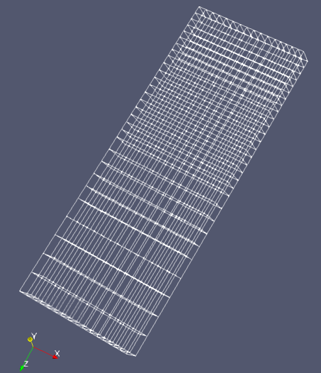

.. _fields_mesh_presentation_page:

*****************
Mesh presentation
*****************

The main purpose of this presentation is to display the mesh structure without any physical data.

This presentation is automatically created when importing a :ref:`fields_data_source_page`.
Additionally, **Mesh** presentation can be created by

* Selecting a Mesh item in the **Object Browser**, and
* Choosing **Presentations > Mesh** menu or clicking |img_msh| button in the *Presentations* toolbar.
