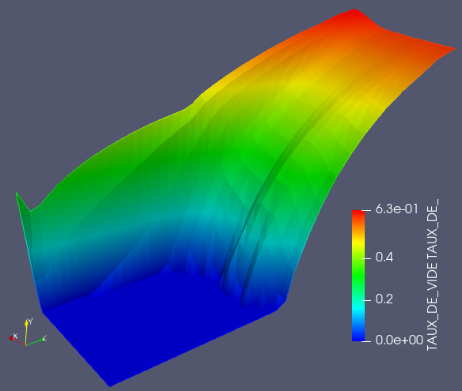

.. _fields_plot3d_presentation_page:

*******************
Plot3D presentation
*******************

**Plot3D** is a presentation of scalar values of meshes lying on a cutting plane.
The relief and coloring of the resulting presentation both correspond to the values applied to the cells of a mesh.

To create a **Plot3D** presentation,

* Select a field item in the **Object Browser**, and
* Choose **Presentations > Plot3D** menu or click |img_pl3| button in the *Presentations* toolbar.

As a result, **Plot3D** presentation is published in the **Object Browser** under selected field and displayed
in the 3D Viewer.

**Plot3D** presentation has the same base parameters as :ref:`fields_scalar_map_presentation_page`, but in addition it also has
the following own specific parameters:

* **Plane normal**: specifies a cutting plane normal and a direction along which to warp a presentation,
* **Plane position**: allows selecting the position of the cutting plane within the bounding box of the
  mesh (ranging from 0 to 1).
