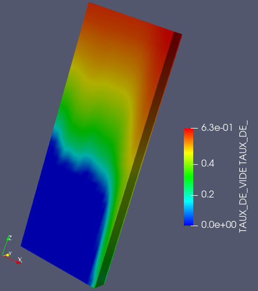

.. _fields_scalar_map_presentation_page:

***********************
Scalar map presentation
***********************

**Scalar map** is the basic type of presentation in Fields module. It consists in coloring each cell of a field
in accordance with the scalar or vector data applied to it.

To create a **Scalar map** presentation,

* Select a field item in the **Object Browser**, and
* Choose **Presentations > Scalar map** menu or click |img_sm| button in the *Presentations* toolbar.

As a result, **Scalar map** presentation is published in the **Object Browser** under selected field and
displayed in the 3D Viewer.

As soon as **Scalar map** presentation is created, it is possible to modify the following base parameters:

* **Show Scalar Bar**: allows showing/hiding Scalar Bar for the presentation,
* **Range**: allows choosing a way of coloring presentation:

  * **All timesteps**: color presentation by the entire dataset in a time series,
  * **Current timestep**: color presentation by the current time step,

* **Color map**: allows choosing a color palette for the presentation - "Cool to warm" or "Blue to red rainbow",
* **Custom Range**: allows coloring presentation according to a custom data range,
* **Hide Data outside custom Range**: allows showing/hiding cells with values outside of the custom range.

In addition, if **Scalar map** presentation is created on a vector field, it is possible to modify the following
parameters:

* **Displayed component**: allows coloring the presentation according to an Euclidean norm value of vector field or
  to a given component of vector field.
