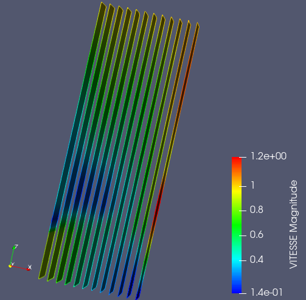

.. _fields_slices_presentation_page:

*******************
Slices presentation
*******************

**Slices** is a type of field presentation, when the given mesh is cut by a number of planes.
These planes are colored according the the values applied to the mesh cells.

.. |img_sl| image:: images/image_slices.png

To create a **Slices** presentation,

* Select a field item in the **Object Browser**, and
* Choose **Presentations > Slices** menu or click |img_sl| button in the *Presentations* toolbar.

As a result, **Slices** presentation is published in the **Object Browser** under selected field and displayed
in the 3D Viewer.

**Slices** presentation has the same base parameters as :ref:`fields_scalar_map_presentation_page`,  plus
the following own ones:

* **Displayed component**: this parameter is available only for vector fields; it allows coloring the presentation
  in accordance with the Euclidean norm value of a vector field or with the given component of a vector field,
* **Number of slices**: specifies the number of cutting planes; max allowed value of this parameter is 20,
* **Slice orientation**: defines an orientation of cutting planes.
