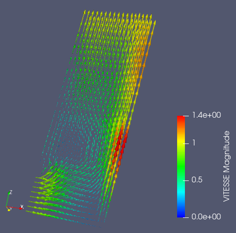
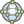

.. _fields_vector_field_presentation_page:

*************************
Vector field presentation
*************************

**Vector field** presentation visualizes vectors of the corresponding mesh cells in graphical mode.

To create a **Vector field** presentation,

* Select a field item in the **Object Browser**, and
* Choose **Presentations > Vector field** menu or click |img_vct| button in the *Presentations* toolbar.

As a result, **Vector field** presentation is published in the **Object Browser** under selected field and displayed
in the 3D Viewer.

**Vector field** presentation has the same base parameters as :ref:`fields_scalar_map_presentation_page`, plus
the following own ones:

* **Scale Factor**: specifies the constant multiplier to apply - it is used to scale vectors.
