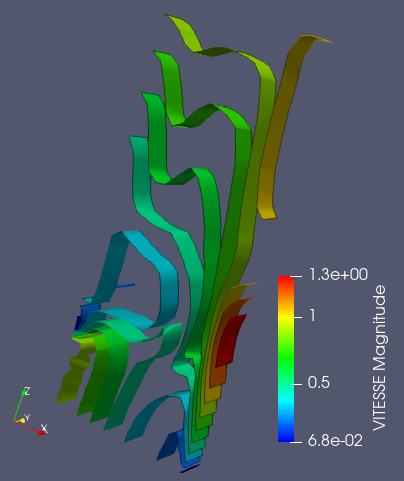

.. _fields_contour_presentation_page:

********************
Contour presentation
********************

**Contour** presentation combines all equal scalar values applied to the cells and constructs isobaric surfaces.

.. |img_ct| image:: ../images/image_contour.png

To create a **Contour** presentation,

* Select a field item in the **Object Browser**, and
* Choose **Presentations > Contour** menu or click |img_ct| button in the *Presentations* toolbar.

As a result, **Contour** presentation is published in the **Object Browser** under selected field and displayed
in the 3D Viewer.

**Contour** presentation has the same base parameters as :ref:`fields_scalar_map_presentation_page`, plus
the following own ones:

* **Number of contours**: number of contours which are generated: max allowed value of this parameter is 50,
* **Contour By**: this parameter is available only for vector fields; it allows choosing the component of the vector
  field from which isobaric surfaces are generated.
