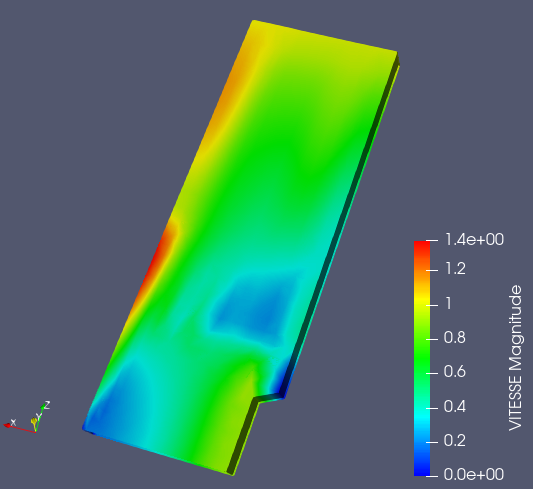

.. _fields_deflection_shape_presentation_page:

*****************************
Deflection shape presentation
*****************************

**Deflection shape** is a type of field presentation when vector values corresponding to the mesh cells are
visualized by shifting these cells.

To create a **Deflection shape** presentation,

* Select a field item in the **Object Browser**, and
* Choose **Presentations > Deflection shape** menu or click |img_dfl| button in the *Presentations* toolbar.

As a result, **Deflection shape** presentation is published in the **Object Browser** under selected field and displayed
in the 3D Viewer.

**Deflection shape** presentation has the same base parameters as :ref:`fields_scalar_map_presentation_page`.
