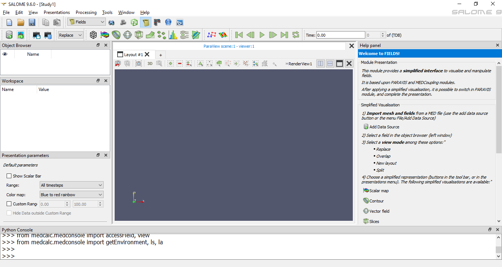

*****************************
Introduction to Fields module
*****************************

Fields module is used for analysis and post-processing of numerical simulation results. It is based upon ParaVis module, MEDReader ParaVis
module plugin and MEDCoupling library. Main advantage of this module is that it provides a simplified (in comparison with ParaVis module)
way to create different presentations. After applying this simplified visualization it is possible to switch to ParaVis module and 
complete a more complex presentation if necessary.

Fields module uses Python API of the ParaVis module to build presentations.
Any presentation in the Fields module is a pipeline of the ParaVis filters, which always starts with MEDReader.
For example, :ref:`fields_plot3d_presentation_page` is a sequence of the following ParaVis filters: **MEDReader > Calculator > WarpByScalar**.
