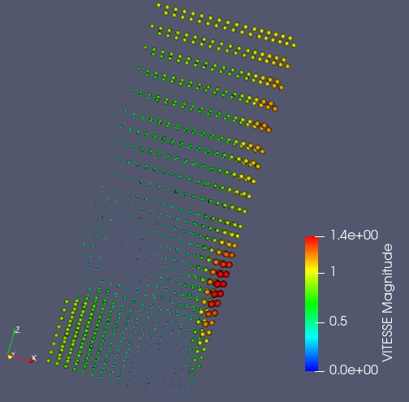
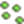

.. _fields_point_sprite_presentation_page:

*************************
Point sprite presentation
*************************

**Point sprite** presentation presents data on field as a set of fixed points of the renormalisation group flow
with Gaussian distribution.

To create a **Point sprite** presentation,

* Select a field item in the **Object Browser**, and
* Choose **Presentations > Point sprite** menu or click |img_ps| button in the *Presentations* toolbar.

As a result, **Point sprite** presentation is published in the **Object Browser** under selected field and displayed
in the 3D Viewer.

**Point sprite** presentation has the same base and additional parameters as :ref:`fields_scalar_map_presentation_page`.

