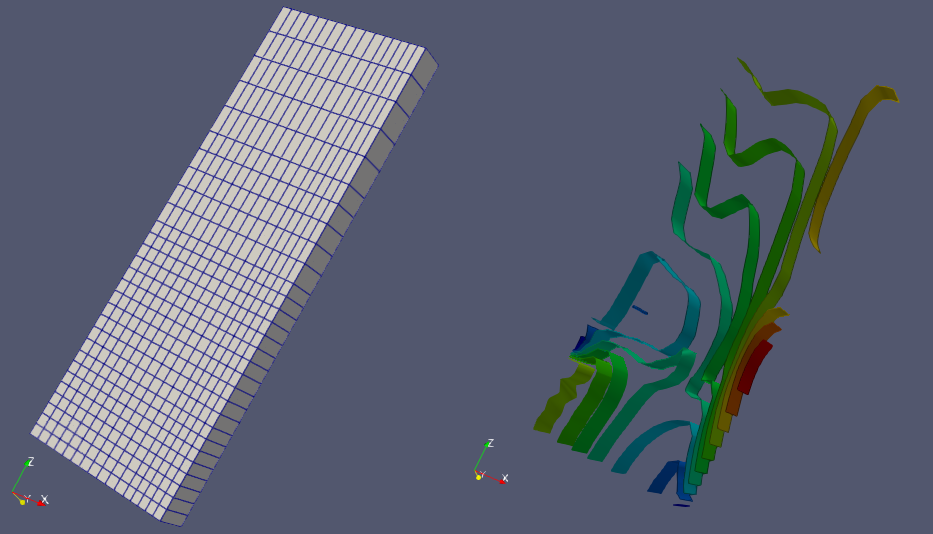

.. _presentations_page:

*************
Presentations
*************

Fields module allows creating several types of presentations. All presentation types can be split in two main groups:

* :ref:`fields_mesh_presentation_page`: can be created on a mesh
* :ref:`fields_fields_presentation_page`: can be created on a field

.. toctree::
   :hidden:
   :maxdepth: 2

   fields_mesh_presentation.rst
   fields_fields_presentation.rst
   fields_managing_presentations.rst

