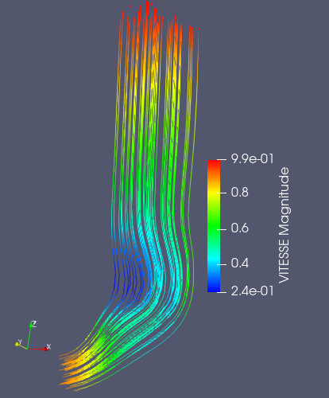
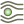

.. _fields_stream_lines_presentation_page:

*************************
Stream lines presentation
*************************

**Stream lines** is a type of presentation transforming the cells with vectors having most similar direction into lines.
A streamline can be thought of as the path that a massless particle takes in a vector field. Streamlines are used to
convey the structure of a vector field.

To create a **Stream lines** presentation,

* Select a field item in the **Object Browser**, and
* Choose **Presentations > Stream lines** menu or click |img_stl| button in the *Presentations* toolbar.

As a result, **Stream lines** presentation is published in the **Object Browser** under selected field and displayed
in the 3D Viewer.

**Stream lines** presentation has the same base parameters as a :ref:`fields_scalar_map_presentation_page`,
but in addition it also has own specific ones:

* **Integration Direction**: specifies in which direction(s) streamlines are generated.
